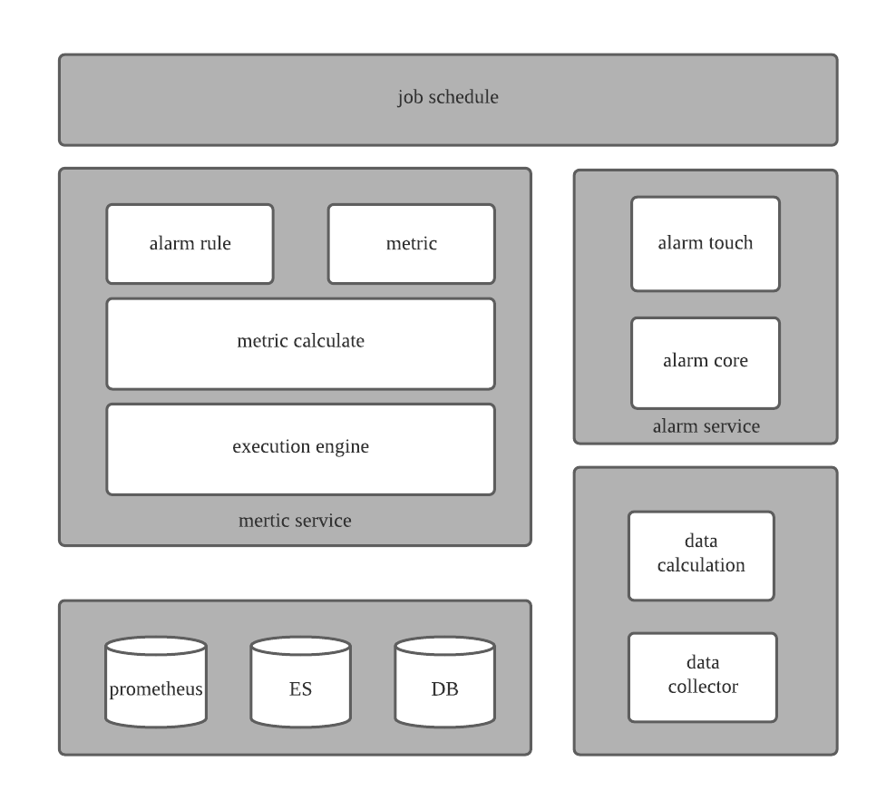

## 服务质量管理平台

服务质量平台（themis），以服务为维度，实时反馈服务的运行状态，提供服务质量信息，系统故障、应用错误和业务异常的告警。

### 项目结构

####代码层级结构
* themis-dao 项目DAO层，为上层模块提供持久层的支持 
* themis-common 主要涵盖业务实体、异常信息、工具类等公共模块内容
* themis-dependent 主要负责对接第三方资源
* themis-metric 监控核心模块，负责指标的计算，规则的对比以及告警的触发
* themis-alarm 告警模块，负责接收告警信息，以预先定义的告警方式下发告警
* themis-portal 负责服务的数据管理

#### 服务模块

##### portal模块(portal service)
由themis-portal、themis-common、dao构成
##### 监控核心模块(metric service)
由themis-metric、themis-common、themis-dependent、dao构成
##### 告警模块(alarm service)
由themis-alarm、themis-common、themis-dependent、dao构成
##### 数据计算模块（data calculation）
（todo）
##### 数据收集模块（data collector）
（todo）